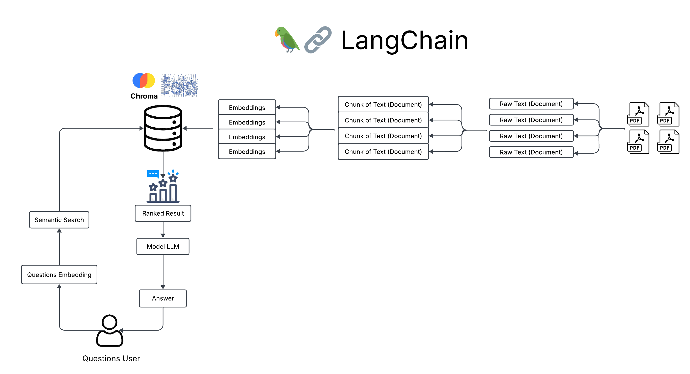
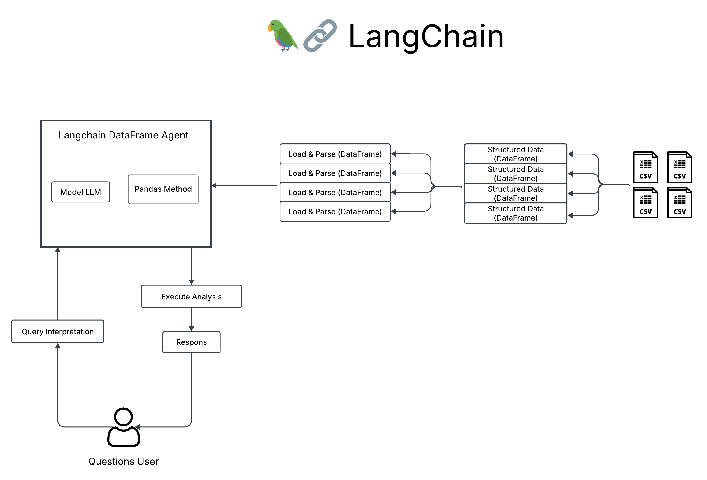

# Chat Application for Multi-PDF Uploads & Data Interaction from Excel/CSV Documents

## Introduction
Chat Application for Multi-PDF Uploads & Data Interaction is an interactive web-based Python application built using Streamlit, allowing you to interact with multiple PDF documents and analyze data from Excel or CSV files. You can ask natural language questions regarding the content of the uploaded document or data, and the application will provide relevant answers based on the information contained in the file. This feature allows you to explore text in PDFs and perform in-depth data analysis.

The app provides a choice of several language models, including `llama-3.3-70b-versatile`, `qwen-2.5-32b`, `gemma2-9b-it`, and `mistral-saba-24b`, which can be selected to provide answers that best suit your needs. Each model offers different capabilities in understanding and responding to queries, providing more flexibility in getting information from uploaded documents and data.

## Features
- Multi-PDF Support: Users can upload multiple PDF files and inquire about the contents of the documents.

- Data Analysis: Upload Excel or CSV files and perform data analysis using the intuitive chat interface.

- Preferred Model: Select the desired language model to answer questions related to documents and data.

- Easy Integration: The app integrates various analysis tools and language models seamlessly, providing an efficient and fast experience.

## How it Works

### Chatbot MultiPDF



The application follows these steps to provide responses to your questions:

1. PDF Loading: The app reads multiple PDF documents and extracts their text content.

2. Raw Text Extraction: The raw text is extracted directly from the PDFs without any further processing.

3. Text Chunking: The extracted text is divided into smaller, manageable chunks to improve processing efficiency and relevance.

4. Embedding Generation: The application utilizes a language model (such as a sentence transformer) to convert text chunks into vector representations (embeddings).

5. Similarity Matching: When you ask a question, the app compares the query with the text chunks using similarity search and identifies the most semantically relevant chunks.

6. Response Generation: The most relevant text chunks are passed to a language model, which generates a response based on the extracted information.

### Chatbot Data Interaction



The application follows these steps to provide responses to your questions:

1. File Loading: The application reads the uploaded Excel/CSV file and loads it as a structured dataset (DataFrame).

2. Data Extraction: The raw tabular data is extracted and prepared for analysis without modification.

3. Data Processing: The extracted data is structured as a Pandas DataFrame, allowing for efficient querying and analysis.

4. Query Interpretation: When you ask a question, the application processes the query and translates it into relevant DataFrame operations.

5. Data Analysis Execution: The chatbot, using a language model, performs calculations, filtering, aggregations, or other analyses based on the question.

6. Response Generation: The results of the analysis are formatted and presented as a response, potentially including tables, summaries, or insights.

## Dependencies and Installation
To install this MultiPDF & Data Interaction Chat App, please follow these steps:

1. Clone the repository to your local machine by following the command:
```
git clone [https://github.com/DimasDwiA/LangChain-File-Chatbot-PDF-Excel-CSV-Interaction]
cd Chatbot
```
2. Install the required dependencies by running the following command:
```
pip install -r requirements.txt
```
3. Set up environment variables: Create a .env file in the root directory and add the following variables:
```
GROQ_API_KEY=<your-groq-api-key>
LANGCHAIN_API_KEY=<your-langchain-api-key>
LANGCHAIN_PROJECT=<your-langchain-project>
HUGGINGFACEHUB_API_TOKEN=<your-huggingface-api-key>
```

## Usage
To use this MultiPDF & Data Interaction Chat App, follow these steps:
1. Ensure that you have installed the required dependencies and added all of the API key to the `.env` file.
2. Run the main.py file using the Streamlit CLI. Execute the following command:
```
streamlit run main.py
```
3. The application will launch in your default web browser, displaying the user interface.
4. Upload single/multiple PDF documents or file Excel/CSV into the app by following the provided instructions.
5. Ask questions in natural language about the loaded PDFs using the chat interface.
6. GGet answers to your questions based on the content of the uploaded PDFs or data files, and interact with the app to explore specific details or insights from the documents.
